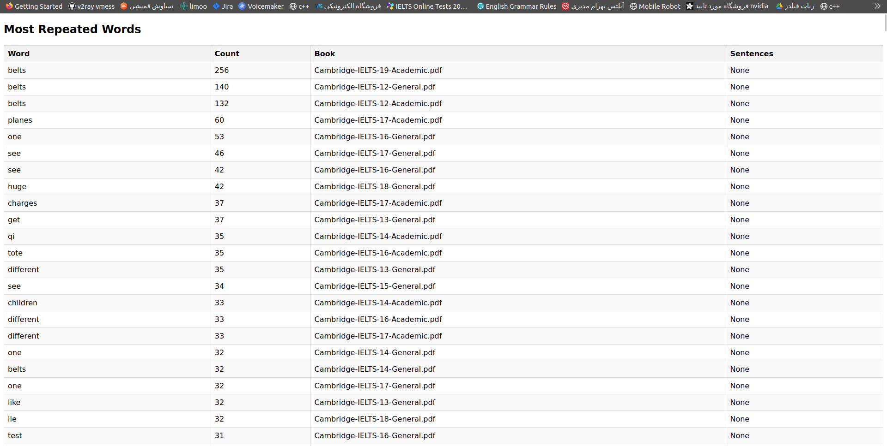

## $${\color{yellow}Cambridge\space IELTS \space PDF \space  Analyzer}$$ :dizzy: 

This project is a FastAPI-based web application designed to analyze $${\color{lightgreen}Cambridge \space IELTS \space PDFs \space (Books 1-18)}$$ for the most and least repeated words. It can handle both regular text-based PDFs and scanned image-based PDFs by converting them to images and extracting text using OCR (Optical Character Recognition). Additionally, it performs spell-checking and word correction to ensure the accuracy of the extracted text.

## $${\color{LightSKYBlue}Features}$$ :bulb:

- **PDF Upload**: Upload PDF files (IELTS books) via the web interface.
- **OCR for Scanned PDFs**: For PDFs that consist of scanned images instead of real text, the application converts the pages to images and extracts text using OCR (via libraries like pytesseract).
- **Spell Checking and Correction**: The application checks all extracted words to ensure they are valid English words. If a word is misspelled or doesn't exist, it automatically finds and replaces it with the nearest correct word (using libraries like textblob or spellchecker).

- **File Management**: List and manage uploaded PDF files.
- **Word Analysis**: Extract and analyze words from the uploaded PDFs, focusing on the most and least frequently occurring words.
- **Metadata Storage**: Store word counts, sentences, and the book reference in an SQLite database.
- **Data Filtering**: Remove common English stop words and non-alphabetic characters. Chinese characters are ignored during analysis.
- **API Endpoints**:
  - `/upload-file/`: Upload PDF files for analysis.
  - `/files/`: List all uploaded files.
  - `/words/most-repeated/`: Retrieve the most repeated words across the uploaded files.
  - `/words/least-repeated/`: Retrieve the least repeated words across the uploaded files.
  - `/analyze/`: Perform a fresh analysis of all uploaded files, extracting word metadata.
- **Customizable Queries**: Fetch the most and least repeated words with customizable limits via query parameters.


## $${\color{LightSKYBlue}Tech \space Stack}$$ :computer:

- **Backend**: FastAPI
- **Database**: SQLite (via SQLAlchemy ORM)
- **PDF Processing**: PyPDF2 and pdfplumber
- **OCR**: pytesseract for text extraction from images in scanned PDFs.
- **Spell Checking and Correction**: textblob or spellchecker for ensuring word accuracy and correcting misspellings.
- **Tokenization and Text Processing**: NLTK (Natural Language Toolkit)
- **Frontend**: Basic HTML/CSS rendering for data display
- **Deployment**: Uvicorn server

## $${\color{LightSKYBlue}Installation}$$ :ghost:

1. Clone the repository:
   ```bash
   git clone git@github.com:fatemeh-mohseni-AI/most-repeated-vocabulary-IELTS.git
   cd most-repeated-vocabulary-IELTS 
   
2. Set up a virtual environment:
    ```bash
    python -m venv venv
    source venv/bin/activate   # On Windows: venv\Scripts\activate

3. Install dependencies:
    ```bash
    pip install -r src/requirements.txt
   
4. create ```books``` directory under ```src``` and add Cambridge pdf files to it.

5. Run the application:
    ```bash
    uvicorn src.main:app --reload
    ```
## $${\color{LightSKYBlue}Future \space Improvements}$$ :zap:    

:one: **Enhanced Text Extraction**: Improve the accuracy of text extraction, especially for complex PDFs, by fine-tuning OCR settings and using more advanced text extraction libraries.

:two: **Frontend Redesign with React**: Build a more user-friendly and interactive frontend using React to display and manage the analysis results.

:three: **Additional Queries**: Implement more sophisticated queries, such as filtering results by book, word length, or frequency range.

:four: **Sentence Metadata**: Store the sentences in which the most important words have been used, and provide endpoints to retrieve this information.

:five: **Word Lemmatization and Stemming**: Incorporate advanced linguistic processing techniques like lemmatization and stemming to group different forms of the same word.

:six: **Advanced Spell Correction**: Use machine learning models to enhance the spell-checking and correction system for better accuracy.

:seven: **Multi-language Support**: Expand the application to support other languages beyond English, including additional character sets and stop word lists.

:eight: **Improved PDF Handling**: Add support for handling password-protected PDFs and improving performance for large documents.

:nine: **User Authentication**: Add user authentication and role-based access control for managing file uploads and analysis data.


## $${\\color{LightSKYBlue}Demo}$$ :iphone:

